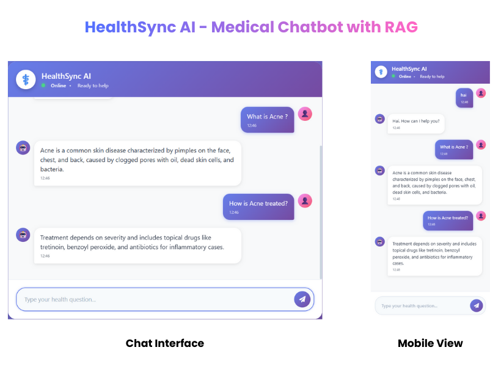

# HealthSync AI - End-to-End Medical Chatbot

<div align="center">


*An AI-powered medical assistant chatbot using Retrieval Augmented Generation (RAG) with LangChain, Groq, and Pinecone.*

</div>

---


##  Overview

**HealthSync AI** is an intelligent medical chatbot that provides accurate health information and answers medical queries using advanced AI technologies. Built with Retrieval Augmented Generation (RAG), it combines the power of:

-  **Large Language Models (LLM)** via Groq API
-  **Vector Database** for medical knowledge retrieval (Pinecone)
-  **Semantic Search** using Sentence Transformers
-  **Conversational Memory** for context-aware responses

The chatbot can answer questions about symptoms, diseases, treatments, and general health information while maintaining conversation context.

---


## Architecture


**Flow:**
1. User sends a medical query through the web interface
2. Flask backend receives the query
3. Query is converted to embeddings using Sentence Transformers
4. Similar medical documents are retrieved from Pinecone vector store
5. Context + Query sent to Groq LLM (Llama 3.3 70B)
6. AI generates a contextually relevant response
7. Response sent back to user with conversation memory

---

## Tech Stack

### **Backend**
- **Framework:** Flask 3.1.2
- **Server:** Gunicorn 23.0.0
- **Language:** Python 3.10

### **AI/ML**
- **LLM:** Groq API (Llama 3.3 70B Versatile)
- **Embeddings:** Sentence Transformers (all-MiniLM-L6-v2)
- **Vector Database:** Pinecone
- **Framework:** LangChain 0.1.20

### **Frontend**
- **HTML**
- **CSS**
- **JavaScript**

### **Deployment**
- **Containerization:** Docker
- **Image Size:** 13.81 GB
- **Base Image:** Python 3.10-slim

---

## Installation

### **Prerequisites**
- Python 3.10+
- pip
- Virtual environment (recommended)
- Groq API Key
- Pinecone API Key

### **1. Clone Repository**
```bash
git clone https://github.com/arunkumareswari/End-to-End-Medical-Chatbot-Generative-AI.git
cd End-to-End-Medical-Chatbot-Generative-AI
```

### **2. Create Virtual Environment**
```bash
python -m venv healthSync
healthSync\Scripts\activate
```

### **3. Install Dependencies**
```bash
pip install -r requirements.txt
```

### **4. Environment Variables**
Create a `.env` file in the root directory:
```env
PINECONE_API_KEY=your_pinecone_api_key_here
GROQ_API_KEY=your_groq_api_key_here
```

**Get API Keys:**
- **Pinecone:** [https://app.pinecone.io/](https://app.pinecone.io/)
- **Groq:** [https://console.groq.com/](https://console.groq.com/)

### **5. Run Application**
```bash
python app.py
```

Visit: `http://localhost:8080`

---

## Screenshots

### **Chat Interface**



---

## ⭐ Show Your Support

If you found this project helpful, please give it a ⭐ on GitHub!

---

